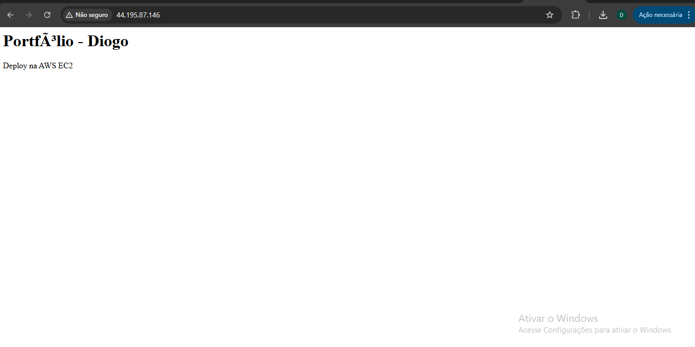
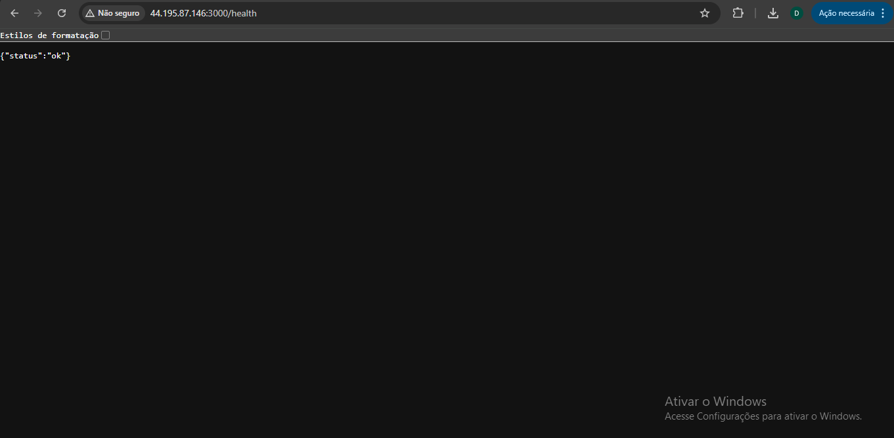
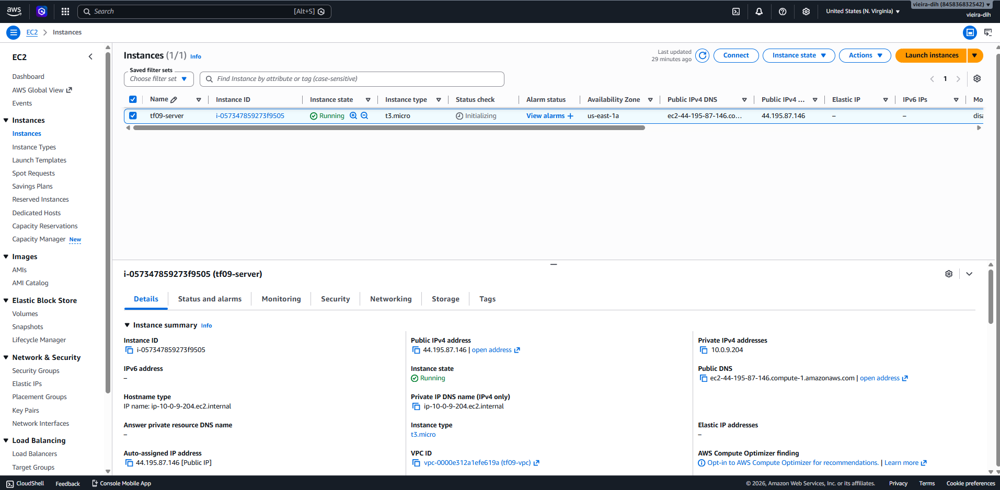
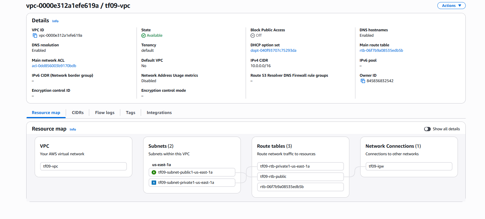
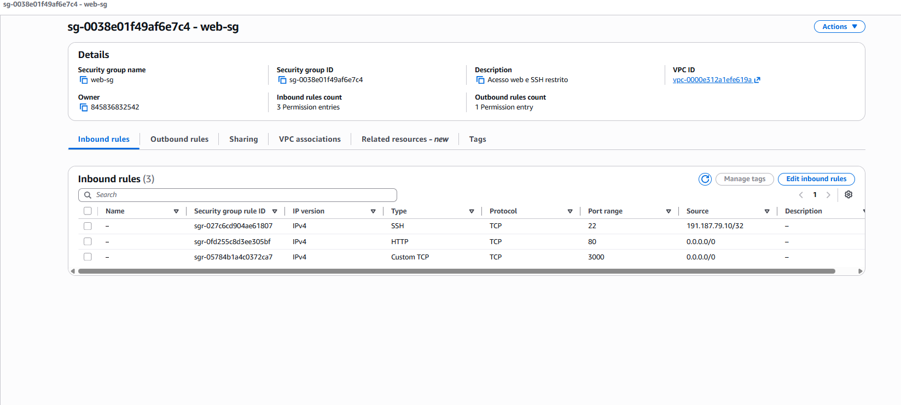

# TF09 - Portfólio Pessoal na AWS

## 👨‍💻 Aluno

* Nome: Diogo Vieira Amorim
* RA: 6324639
* Curso: Análise e Desenvolvimento de Sistemas

---

## 📌 Visão Geral

Este projeto demonstra a criação de uma infraestrutura na AWS utilizando EC2 e VPC para hospedar uma aplicação web de portfólio pessoal, aplicando boas práticas de segurança de rede.

---

## 🏗️ Arquitetura

### VPC Configuration

* CIDR Block: 10.0.0.0/16
* Região: us-east-1

### Subnets

* Public Subnet: 10.0.1.0/24
* Private Subnet: 10.0.2.0/24

### Routing

* Public Route Table: 0.0.0.0/0 → Internet Gateway
* Private Route Table: sem acesso à internet

---

## 💻 Tecnologias Utilizadas

* AWS EC2
* AWS VPC
* Docker
* Docker Compose
* Node.js (Backend)
* Nginx (Frontend)

---

## 🔐 Segurança Implementada

* SSH restrito ao IP do administrador
* HTTP liberado para acesso público
* Porta 3000 liberada apenas para testes
* Banco de dados não exposto publicamente
* Uso de subnet privada
* Princípio do menor privilégio aplicado

---

## ▶️ Como Executar

```bash
docker compose up -d
```

---

## 🌍 Acesso

* Frontend: http://44.195.87.146
* Healthcheck: http://44.195.87.146:3000/health

---

## 🧪 Testes

* docker ps
* curl localhost:3000/health
* acesso via navegador

---

## 💰 Custos Estimados

* EC2 t3.micro (Free Tier)
* Sem NAT Gateway
* Custo estimado: $0

---

## 📸 Evidências

### Aplicação




### Infraestrutura AWS






---


